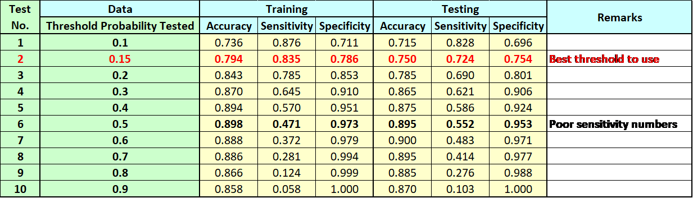
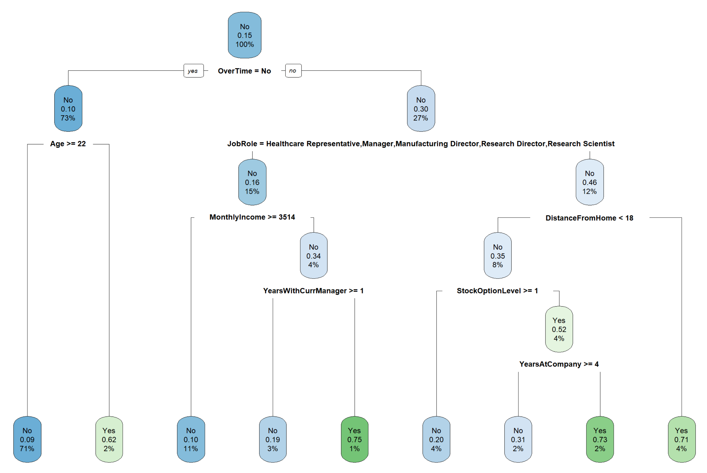

# Project_Predictive_Analytics_R

This was part of my course work for UNSW Master of Analytics in Predictive Analytics using R.

Github repository at: [https://github.com/gpang98/Project_Predictive_Analytics_R.git](https://github.com/gpang98/Project_Predictive_Analytics_R.git)

## Table of Contents

1. [Introduction](#introduction)
   1. [Overview](#overview)
   2. [Objective](#objective)
2. [Getting Started](#getting-started)
   1. [Prerequisites](#prerequisites)
   2. [Installation](#installation)
3. [Approach](#approach)
   1. [Methodology](#methodology)
   2. [Scripts](#scripts)
4. [Repository Structure](#repository-structure)
5. [Data Sources and Copyright](#data-sources-and-copyright)
   1. [Data Sources](#data-sources)
   2. [Copyright Notice](#copyright-notice)
6. [Conclusion](#conclusion)
7. [References](#references)


## Introduction

### Overview

Three prediction models are proposed to predict the likelihood of whether staff will leave the company (Globex Pharma) or not.

We are predicting the value of a categorical variable, i.e., whether an employee will be leaving the company or not, hence linear regression which predict the value of a continuous variable is not suitable and only logistic regression and decision tree are appropriate for this task (UNSW 2022).  DataRobot can be used too but it is not used for this prediction.  

I am the sole contributor to this project.

### Objective
As the newly hired consulting firm for a pharmaceutical company, Globex Pharma, we have been asked to build the best 3 models for predicting whether or not an employee will leave the company, and to glean insights from which predictors are used in the model about what they might do to reduce attrition.


## Getting Started

### Prerequisites

- Python (version 3.x recommended)
- install R programming codes
- A modern web browser

### Installation

To get started with the dashboard:

1. Clone the repository to your local machine:
   ```
   git clone https://github.com/gpang98/Project_Predictive_Analytics_R.git
   ```
2. (Optional) Set up a virtual environment in the project directory.

## Approach

### Methodology

The first approach is to inspect the dataset, employee2.csv.  It is noted that Over18 column can be ignored because all the value are Yes and hence doesn’t add any value in trying to differentiate whether an over 18 will leave the company or not.  So, this column is ignored in all the prediction models.

We ran cross correlation of Attrition to all the possible variables and the values are tabulated below .  None are above 0.5 meaning poor correlation between Attrition to any of these variables.  Almost all are negative values meaning they are inversely correlated.  OverTime has the highest positive value meaning the higher the OverTime (value are 1 for Yes and 0 for No) value, the higher likelihood of employees leaving the company.

We then split the dataset, 80% as training dataset while the rest as testing dataset.  We make model prediction using the training dataset and later test the prediction using the testing dataset.  We judge how good the logistic regression predictive models based on AUC (Area Under the ROC curve) (Starmer 2019) and the confusion matrix (Starmer 2018) computation for accuracy, sensitivity and specificity. The closer these numbers are to the value of 1, the better the prediction model fit the data.  Finally, we also ran test on what is the most optimum threshold probability to use in make prediction for staff leaving.

After exploring various predictive models, the following three models are selected for being the most accurate ones:
1.	Using logistic regression model up to three asterisk (***) statistically significant variables minus NumCompaniesWorked.
2.	Using logistic regression model up to two asterisk (**) statistically significant variables.
3.	Using decision tree predictive model using all available variables minus Over18 and Attrition.


**Dataset:**

1. **employees2.csv:** The dataset emplyees2.csv is given as the main dataset for this exercise.  The dataset is clean and doesn't need any cleaning.


## Scripts 

- `App6.1.1_Assessment_Employees_CorrelationMatrix_employees.ipynb`: Jupyter notebook for generate Correlation Matrix.
- `App6.1.2_Model1_use_all_variables_Testing_15Jun22.ipynb`: Script to do Logistic Regression Prediction using all variables
- `App6.1.3_Model1_Selected_variables_Stat_Sign_3staronly.ipynb`: Script to do Logistic Regression using up to 3* Statistically Significant variables..
- `App6.1.4_Model1_Selected_variables_Stat_Sign_3staronly_minus_NumCompWorked.ipynb`: Script to do Logistic Regression using up to 3* Statistically Significant variables minus NumCompaniesWorked.
- `App6.1.5_Compare_Logistic_Model1_3_AUC_plots.ipynb`: Script to do AUC calculation and plotting for Logistic Regression for Model 1-3.
- `App6.2.1_Compare_Logistic_Model4_5_AUC_plots.ipynb`: Script to generate AUC plot for Model 4 and 5.
- `App6.2.2_Model1_Selected_variables_Stat_Sign_upto2staronly.ipynb`: Script to do Logistic Regression using up to 2* statistically significant variables.
- `App6.2.3_Model1_Selected_variables_Stat_Sign_upto1staronly.ipynb`: Script to do Logistic Regression using up to 1* statistically significant variables.
- `App6.3.1_Model3_all_variable_AUC_threshold_number_testy.ipynb`: Script to plot AUC and best threshold probability for Decision Tree with all variables.
- `App6.3.2_Model3_Testing_threshold_probability_all_variables.ipynb`: Script to do Decision Tree Prediction using all variables minus Over18 and Attrition.


## Repository Structure

- **Root Directory:** Contains the Jupyter notebooks (`App6.1.1_Assessment_Employees_CorrelationMatrix_employees.ipynb`, etc.), employees2.csv dataset, vaious Figures and README files.


## Data Sources and Copyright

### Data Sources

- **UNSW**: The dataset was provided by UNSW as part of the course requirement.

## Conclusion

We proposed two predictive (Model 3b & 4b - refer  and ) models using logistic regression and one using decision tree (Model6) in determining whether staff will leave the company or not.  Based on the AUC, accuracy, sensitivity and specificity, the best prediction model to determine whether employee will leave the company is the second logistic prediction model (Model4b).   This model is able to predict with 76% probability that an employee will leave or not based on the available data on whether employee is working overtime, job satisfaction, job involvement, job role, business travel, environment satisfaction, number of companies worked, distance from home and work life balance in decreasing order of importance.  Earlier, Model3a had identified that the five most important variables are BusinessTravel, OverTime, JobSatisfaction, EnvironmentSatisfaction and JobInvolvement will determine whether staff will leave or not.  

Furthermore, the decision tree prediction model  suggests that those working less than 4 years at the company, not having stock options, younger than 22, worked less than 1 year with current manager and drawing less than $3514 monthly income are important consideration too. 

Due to these predictions, we recommend the following actions to be taken by the company to reduce the likelihood of employee leaving:
1.	Monitor those who worked overtime.  Why are they working overtime?  Is it necessary?  Find ways to reduce overtime.  Can the workload be distributed?  Do we need to hire more people?
2.	Find out why the younger staffs are leaving.  Are the younger staffs especially those under 4 years with company are given sufficiently suitable, challenging and offered good career progression?  Can they be incentivised with stock options?  Can their salary be increase?
3.	Find out why those who worked as Sales Representative, Laboratory Technician and Sales Executive are not happy? Is it related to overtime, business travel, job satisfaction, work environment, job involvement, salary, or work life balance?  Find out what company might be able to offer to help alleviate any of the problem.

These observations and recommendations seem to agree with Oliver, 1998 who had mentioned before that high staff turnover is usually a function of negative job attitudes and/or low job satisfaction.  She further mentioned that statistic show that one-fifth of employees quit within the first 6 months of employment due to bad job fit among other reasons.

With more information, company then will be able to take necessary actions to rectify the situation so that the reason for leaving can be minimized. We will never be able to eliminate staff attrition but less than 10% would be a healthy target to achieve (Insight Global 2021).


## References

- Codes and approaches inspired by lecture notes.
- [1] Galak, J, 2020, Statistical Significance and p-Values Explained Intuitively, Data Demystified. [https://www.youtube.com/watch?v=DAkJhY2zQ3c] [Assessed 19 June 2022]
- [2] Oliver, J 1998, ‘High staff turnover - find out why your staff are leaving’, Management today, p. 84.
- [3] Insight Global, 2021, Employee Attrition Rate: How to Calcualte & Improve.
[https://insightglobal.com/blog/employee-attrition-rate-how-to-calculate-improve/#:~:text=While%20it%E2%80%99s%20difficult%20to%20define%20a%20%E2%80%9Cgood%E2%80%9D%20attrition,and%20industry%20to%20industry%2C%20depending%20on%20the%20circumstances.] [Assessed 19 June 2022]
- [4] Starmer, J, 2018, Machines Learning Fundamentals: The Confusion Matrix, Clearly Explained, StatQuest. [https://youtu.be/Kdsp6soqA7o] [Assessed 7 June 2022]

- [5] Starmer, J, 2019, ROC and AUC, Clearly Explained, StatQuest.
[https://www.youtube.com/watch?v=4jRBRDbJemM] 

- [6] UNSW, 2022, ZZBU6511-Predictive Analytics (H322 Online) Week 4: Prediction – Logistic regression course note.
- [7] UNSW, 2022, ZZBU6511-Predictive Analytics (H322 Online) Week 5: Prediction with decision trees course note.


